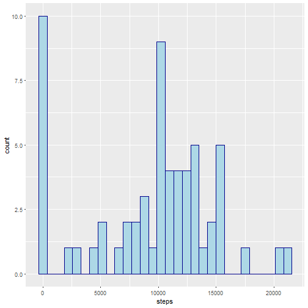

```r
---
output: 
  html_document: 
    keep_md: yes
---
# Reproducible Research: Peer Assessment 1"

## Loading and preprocessing the data
```

```
## Error: <text>:9:0: unexpected end of input
## 7: 
## 8: ## Loading and preprocessing the data
##   ^
```

```r
f <- read.table(file=unz('activity.zip','activity.csv'),header = TRUE, sep = ',', colClasses = c('integer', 'Date', 'integer' ))
```

## What is mean total number of steps taken per day?

```r
library(data.table)
dt <- data.table(f)
# 1. Calculate the total number of steps taken per day
stepsPerDay <- dt[,{steps=sum(steps,na.rm = TRUE); list(steps=steps)}, by=date]
# 2. Make a histogram of the total number of steps taken each day
library(ggplot2)
ggplot(stepsPerDay, aes(x=steps))+
  geom_histogram(color="darkblue", fill="lightblue")
```

```
## `stat_bin()` using `bins = 30`. Pick better value with `binwidth`.
```


Calculate and report the mean and median of the total number of steps taken per day

```r
mean(stepsPerDay$steps)
```

```
## [1] 9354.23
```

```r
median(stepsPerDay$steps)
```

```
## [1] 10395
```


## What is the average daily activity pattern?

```r
# 1. Make a time series plot (i.e. type = "l") of the 5-minute interval (x-axis) and the average number of steps taken, averaged across all days (y-axis)
averageSteps <- dt[, {steps=mean(steps, na.rm = TRUE); list(steps=steps)}, by=interval]
qplot(y=steps, x=interval, data=averageSteps, geom="line", color=I("darkblue"))
```


On average the 5-minute interval across all the days in the dataset which contains the maximum number of steps is 

```r
# 2. Which 5-minute interval, on average across all the days in the dataset, contains the maximum number of steps?
averageSteps[which.max(averageSteps$steps), ]
```

```
##    interval    steps
## 1:      835 206.1698
```


## Imputing missing values
The total number of missing values in the dataset is 

```r
# 1. Calculate and report the total number of missing values in the dataset (i.e. the total number of rows with NAs)
sum(is.na(dt$steps))
```

```
## [1] 2304
```
Fill in missing values with the mean value for the day if available, otherwhise with the mean value from all days

```r
# 2. Devise a strategy for filling in all of the missing values in the dataset. 
# -> fill in missing values with the mean value for the day if available, otherwhise with the mean value from all days
# 3. Create a new dataset that is equal to the original dataset but with the missing data filled in.
meanStepsPerDay <- dt[,{steps=mean(steps,na.rm = TRUE);list(steps=steps)}, by=date]
meanStepsPerDay[is.na(steps)]$steps <- mean(dt$steps, na.rm = TRUE)
for (d in meanStepsPerDay$date) {
	dt[is.na(steps) & date == d]$steps <- as.integer(meanStepsPerDay[date == d]$steps)
}
```
With the filled-in data we make a histogram of the total number of steps taken each day 

```r
# 4. Make a histogram of the total number of steps taken each day and Calculate and report the mean and median total number of steps taken per day. Do these values differ from the estimates from the first part of the assignment? What is the impact of imputing missing data on the estimates of the total daily number of steps?
stepsPerDay2 <- dt[,{steps=sum(steps);list(steps=steps)}, by=date]
ggplot(stepsPerDay2, aes(x=steps))+
  geom_histogram(color="darkblue", fill="lightblue")
```

```
## `stat_bin()` using `bins = 30`. Pick better value with `binwidth`.
```


.. and report the mean and median total number of steps taken per day

```r
mean(stepsPerDay2$steps)
```

```
## [1] 10751.74
```

```r
median(stepsPerDay2$steps)
```

```
## [1] 10656
```

```r
# The impact of imputting missing data increases the number of days with around 10.000 steps per day
```
The impact of imputting missing data increases the number of days with around 10.000 steps per day.

## Are there differences in activity patterns between weekdays and weekends?
Create a new factor variable in the dataset with two levels – “weekday” and “weekend” indicating whether a given date is a weekday or weekend day.

```r
# set locale to english to preserve the weekday names
Sys.setlocale("LC_ALL","English")
# 1. Create a new factor variable in the dataset with two levels – “weekday” and “weekend” indicating whether a given date is a weekday or weekend day.
wd <- weekdays(dt$date,TRUE)
dt[ , day:='weekday']
dt[wd == 'Sun']$day <- 'weekend'
dt[wd == 'Sat']$day <- 'weekend'
dt[ , day:=as.factor(day)]
```
Make a panel plot containing a time series plot of the 5-minute interval (x-axis) and the average number of steps taken, averaged across all weekday days or weekend days (y-axis).

```r
# 2. Make a panel plot containing a time series plot (i.e. type = "l") of the 5-minute interval (x-axis) and the average number of steps taken, averaged across all weekday days or weekend days (y-axis).
avgWd <- dt[,{steps=mean(steps);list(steps=steps)}, by=c('interval','day')]
ggplot(data = avgWd, aes(y=steps, x=interval)) + geom_line(color="darkblue") + facet_grid(day ~ .)
```


```
```

